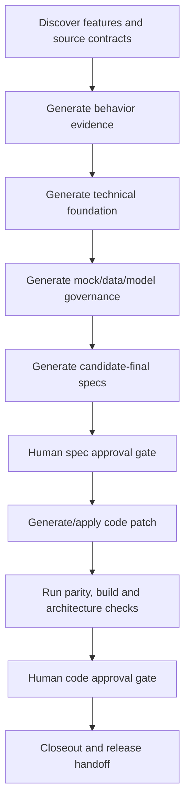

# Autonomous Gated Migration

Status: draft
Audience: maintainers, migration orchestrators, architects, QA reviewers

## Purpose

Autonomous gated migration is the factory mode for doing the full migration
loop with automation while keeping explicit human approval gates.

The intent is:

- prove behavior automatically where evidence can be executed or compared;
- generate final-candidate Epics, User Stories and Hard Specs;
- propose and apply code changes automatically inside a controlled branch or
  patch flow;
- recommend company-specific architecture tools and libraries from detected
  context;
- stop at human gates before final acceptance, merge, deployment or durable
  platform decisions.

## Operating Rule

The factory may automate generation and execution. It must not automate
approval.

Automated artifacts use these statuses:

| Status | Meaning | Human Gate |
| --- | --- | --- |
| `generated` | created by the factory from source context, templates or scripts | review required |
| `candidate-final` | internally consistent and ready for human approval | approval required |
| `approved` | explicitly accepted by a human owner | can drive implementation |
| `applied` | code or artifact change has been written to the target branch/worktree | review required before merge |
| `rejected` | human rejected the generated output | update inputs or create a Spike |

## Capability Targets

### 1. Automatic Behavior Proof

The factory should automatically collect and compare behavior evidence when the
source and target can be executed safely.

Evidence options:

- API contract extraction and request/response examples;
- existing test discovery and reuse;
- synthetic fixture generation for happy, edge and bad cases;
- mock-server scenario execution;
- golden-master snapshots for observable outputs;
- source-vs-target contract comparison;
- error, permission, timeout and side-effect checks;
- evidence reports linked to `LB-*`, `AC-*`, `HS-*` and `EV-*` IDs.

Human gate:

- approve the behavior baseline;
- approve any unresolved behavior gaps as explicit risk;
- reject generated evidence that is incomplete, flaky or unsafe.

### 2. Final-Candidate Epics And Stories

The factory should generate complete Epic, User Story, Hard Spec and Spike
artifacts from discovered behavior, target foundation and parity evidence.

Generated specs may become `candidate-final` automatically when:

- scope, non-goals and acceptance criteria are consistent;
- every acceptance criterion maps to Hard Spec coverage;
- every Hard Spec requirement maps to evidence or accepted risk;
- architecture and model-governance decisions are linked;
- open questions are either closed or explicitly marked as non-blocking.

Human gate:

- approve candidate-final specs before they become implementation authority;
- split any new feature or behavior change into a separate story.

### 3. Automatic Code Migration

The factory should be able to generate and apply target code changes inside a
controlled branch or worktree after specs and architecture gates are approved.

Expected behavior:

- create or update code according to the accepted Hard Spec;
- preserve observable behavior;
- follow target repo conventions and company libraries;
- use generated DTOs only at approved boundaries;
- add adapters, ACLs, mappers, tests and mock fixtures where required;
- run target validation commands;
- produce a change report with files changed, tests run and residual risk.

Human gate:

- approve before code changes are written when the operation is high risk;
- approve before commit, push, PR, merge, release or deployment;
- reject patches that fail parity, architecture or review gates.

### 4. Company-Specific Architecture Decisions

The factory should detect company-specific architecture providers, libraries,
frameworks, code-generation plugins and platform constraints from target repo
metadata and documentation.

The factory may recommend:

- required platform libraries;
- approved mock-server/test tooling;
- package/module conventions;
- DTO/model/ACL/mapping rules;
- logging, telemetry, auth and HTTP-client standards;
- architecture tests or static checks.

Human gate:

- approve the recommendation before it becomes a binding architecture decision;
- create a Spike when detected evidence is ambiguous;
- record accepted decisions in ADRs and implementation briefs.

## Autonomous Pipeline

## Safety Constraints

- Do not use production data as fixtures.
- Do not write or expose secrets.
- Do not perform destructive commands automatically.
- Do not deploy automatically.
- Do not merge automatically.
- Do not mark behavior as proven unless evidence is executable, comparable or
  explicitly accepted as manual evidence.
- Do not treat generated specs as approved merely because they are internally
  consistent.

## Required Artifacts

| Capability | Artifact |
| --- | --- |
| behavior proof | behavior evidence report |
| final-candidate specs | Epic, User Story, Hard Spec and parity traceability |
| code migration | implementation plan, patch report and validation report |
| architecture tools | ADR with options and recommendation |
| approval | gate decision log in the package index |

## Search Anchors

- autonomous gated migration
- automatic behavior proof
- candidate final specs
- automatic code migration
- human approval gate
- architecture tool recommendation
