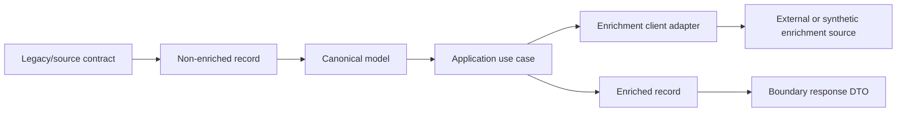

# Model Governance - <Feature Or Foundation>

Status: draft
Sensitivity: public-safe-example | internal | confidential
Related package index: `<path>`
Related technical foundation: `<path>`
Related implementation brief: `<path>`

## Purpose

Define which models are generated, curated, preserved, enriched, mapped and
validated during migration.

Model governance exists to avoid accidental behavior changes caused by leaking
generated DTOs into use cases, mutating source records during enrichment or
hiding compatibility-sensitive mapping inside implicit code.

## Recommendation

- Keep generated DTOs at the API/client boundary.
- Preserve the non-enriched source/canonical record as a stable baseline.
- Expose enriched records as separate read/result models.
- Curate domain or application models only where target invariants exist.
- Isolate clients behind adapters or ACLs.
- Test mappers with synthetic raw/canonical/enriched fixture pairs.

## Model Inventory

| Model | Type | Generated Or Curated | Owner | Allowed Dependencies | Status |
| --- | --- | --- | --- | --- | --- |
| <Raw Record> | non-enriched source/canonical record | curated | architect/developer | none or source contract only | draft |
| <Canonical Model> | internal application/domain model | curated when justified | architect | validation and policies | draft |
| <Enriched Record> | exposed enriched read/result model | curated | developer/spec-owner | enrichment adapters and mappers | draft |
| <Boundary DTO> | API/client contract | generated | developer | web/client boundary | draft |
| <Enrichment Model> | external/enrichment contract | generated or curated by boundary | developer | adapter/ACL only | draft |

## Boundary Rules

| Boundary | Rule | Validation |
| --- | --- | --- |
| DTO to command/result | explicit mapper | fixture pair test |
| raw to canonical | preserve source semantics | parity fixture |
| canonical to enriched | enrichment is additive unless approved otherwise | happy/edge/bad fixtures |
| client to adapter/ACL | normalize errors and timeouts | mock-server scenarios |
| enriched to response | map only approved fields | contract snapshot |

## Model Flow

## Governance Decisions

| Decision | Option A | Option B | Recommendation | Gate |
| --- | --- | --- | --- | --- |
| Generated DTO usage | use everywhere | boundary only | boundary only | architecture review |
| Source record handling | mutate during enrichment | preserve and enrich separately | preserve non-enriched baseline | parity plan |
| Mapper style | implicit/reflection mapping | explicit mapping | explicit for behavior-sensitive paths | code review |
| Client handling | direct calls in use cases | adapter/ACL boundary | adapter/ACL for integration contracts | implementation brief |

## Review Gate

Before implementation:

- model inventory is accepted;
- generated and curated artifacts are separated;
- raw/non-enriched and enriched outputs are distinct where required;
- mapper tests and mock scenarios are linked to parity evidence;
- unresolved model decisions are recorded as open questions.

## Search Anchors

- model governance
- generated dto boundary
- non enriched record
- enriched record
- mapper governance
- acl adapter model boundary
