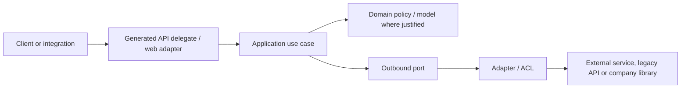
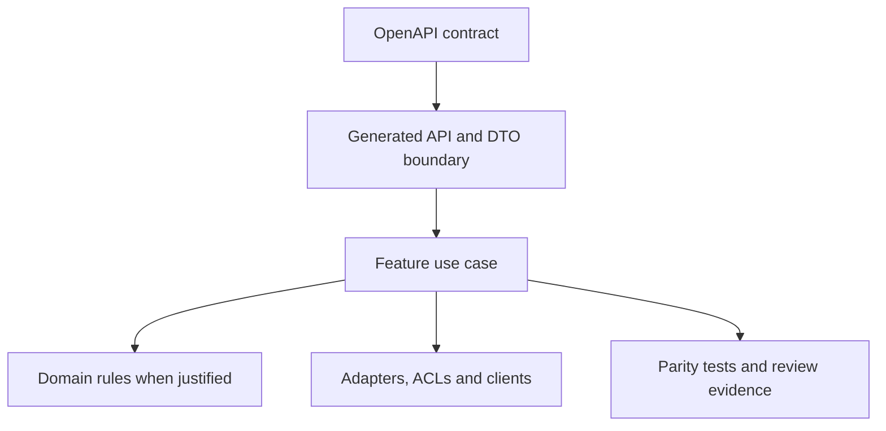

# Technical Foundation And Architecture Blueprint - <Target System>

Status: draft
Language policy: English only | match target project
Sensitivity: public-safe-example | internal | confidential
Related roadmap: `<path>`
Related discovery inventory: `<path>`

## Purpose

Define the technical foundation that migration packages should follow before
code generation or implementation starts.

## Recommendation

- Architecture style:
- Design level:
- Primary slicing model:
- API contract source:
- DTO policy:
- Domain/application model policy:
- ACL/adapter policy:
- Validation strategy:
- Code style:

## Foundation Decisions

| Decision | Option A | Option B | Recommendation | Gate |
| --- | --- | --- | --- | --- |
| Architecture slicing | layered by technical concern | vertical slices by feature/API area | vertical slices with explicit boundaries | architecture review |
| DTO generation | generate all DTOs and use everywhere | generate boundary DTOs only | generate boundary DTOs; curate internal models | spec review |
| ACL/adapters | call integrations directly | isolate integrations behind adapters/ports | isolate external and legacy integrations | implementation brief |
| Domain model | generate domain from contracts | model only real invariants | curate models where business rules exist | feature package review |

## Technical Stack

- Runtime:
- Framework:
- API generation:
- Validation:
- Observability:
- Security:
- HTTP clients:
- Testing:
- Architecture tests:

## Generation Policy

### Generated Automatically

- API interfaces/delegates:
- Boundary DTOs:
- Client DTOs:
- Test scaffolds:

### Curated By Engineers

- Domain models:
- Use cases:
- ACLs/adapters:
- Mappers:
- Validators:
- Error handling:
- Transaction boundaries:

### Never Generated Blindly

- Business invariants.
- Permission behavior.
- Error semantics.
- Side effects.
- Data persistence behavior.
- Rollout and rollback behavior.

## Target Package Blueprint

```text
<base-package>/
  <vertical-slice>/
    web/
    application/
    domain/
    infrastructure/
    mapper/
    validation/
```

## Design Pattern Policy

| Pattern | Use When | Avoid When |
| --- | --- | --- |
| Adapter / ACL | external, legacy or company-library contract should not leak inward | the dependency is already the target platform boundary |
| Mapper | generated DTOs and internal models have different reasons to change | one object is only passed through unchanged |
| Strategy | behavior has real runtime or domain variants | branching is trivial and local |
| Factory / Builder | object creation has invariants or many required inputs | construction is simple and obvious |
| Repository | persistence details must be isolated from domain/application logic | there is no persistence boundary |

## Code Style Rules

- Use guard clauses for invalid input, unsupported state and missing required
  dependencies.
- Keep generated DTOs at the boundary.
- Keep controllers/delegates thin.
- Put orchestration in application use cases.
- Keep domain rules framework-light when meaningful invariants exist.
- Prefer explicit mappers over hidden reflection for behavior-critical mapping.
- Normalize errors at the boundary.
- Keep tests aligned with behavior IDs and validation evidence IDs.

## Validation Gates

| Gate | Required Evidence |
| --- | --- |
| Before code generation | OpenAPI/source contract selected and package scope accepted |
| Before implementation | behavior inventory, parity plan, Hard Spec and architecture decision |
| Before review | generated code isolated, use case implemented, tests passing |
| Before closeout | parity evidence, residual risk and follow-ups recorded |

## Architecture Diagram



## Slice Diagram



## Open Questions

| Question | Owner | Blocks | Status |
| --- | --- | --- | --- |
| <question> | <role> | <artifact/gate> | open |

## Search Anchors

- technical foundation
- architecture blueprint
- vertical slice
- generated DTOs
- anti-corruption layer
- guard clauses
