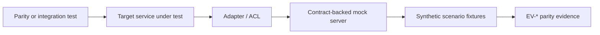

# Mock Server Strategy - <Feature Or Foundation>

Status: draft
Sensitivity: public-safe-example | internal | confidential
Related package index: `<path>`
Related parity plan: `<path>`
Related technical foundation: `<path>`

## Purpose

Define where mocks belong, which behavior they simulate and how they support
behavior parity without replacing real validation.

## Recommendation

- Use in-process fakes for fast use-case tests.
- Use a contract-backed mock server for adapter, ACL and E2E parity tests.
- Keep mock scenarios deterministic and traceable to behavior IDs.
- Do not call production or uncontrolled upstream systems from automated parity
  tests.

## Decision

| Decision | Option A | Option B | Recommendation | Gate |
| --- | --- | --- | --- | --- |
| Use-case tests | in-process fakes | mock server | fakes for speed and focused assertions | developer/QA review |
| Adapter/ACL tests | hand-written client stubs | contract-backed mock server | mock server for protocol and failure parity | architecture review |
| E2E parity | real upstream systems | deterministic local mocks | local mocks unless a safe certified environment is approved | QA review |

## Mock Boundaries

## Scenario Matrix

| ID | Scenario | Mock Behavior | Related Behavior IDs | Evidence IDs |
| --- | --- | --- | --- | --- |
| MS-001 | happy-minimal | minimum valid source response | LB-<id> | EV-<id> |
| MS-002 | happy-complete | all optional enrichment data present | LB-<id> | EV-<id> |
| MS-003 | edge-empty | empty or missing optional data | LB-<id> | EV-<id> |
| MS-004 | bad-invalid-request | validation failure | LB-<id> | EV-<id> |
| MS-005 | bad-upstream-error | upstream error response | LB-<id> | EV-<id> |
| MS-006 | bad-timeout | unavailable or slow upstream | LB-<id> | EV-<id> |
| MS-007 | bad-malformed-payload | unexpected payload shape | LB-<id> | EV-<id> |
| MS-008 | security-denied | unauthorized or forbidden access | LB-<id> | EV-<id> |

## Fixture Rules

- No production data.
- No copied private payloads.
- One fixture profile per behavior risk.
- Deterministic fixture IDs.
- Valid and invalid cases paired where practical.
- Snapshot only observable contracts, not private implementation details.

## Review Gate

Before implementation starts:

- mock-server tool is accepted by the target platform;
- scenario matrix covers happy, edge and bad cases;
- fixture names are traceable to the parity plan;
- unsupported scenarios are recorded as validation gaps.

## Search Anchors

- mock server strategy
- contract backed mocks
- synthetic fixtures
- behavior parity
